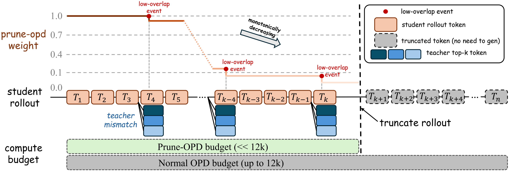

<div align="center">

<h1 style="display: flex; justify-content: center; align-items: center; gap: 10px; margin: 0;">
  Prune-OPD: Efficient and Reliable On-Policy Distillation for Long-Horizon Reasoning
</h1>

<p align="center">
  <em>Reliability-aware pruning for scalable on-policy distillation.</em>
</p>

<div align="center">
  <a href="https://arxiv.org/abs/2605.07804"></a>
</div>

<div align="center">
  
</div>

</div>

## Setup

We recommend a CUDA 12 machine with 8 NVIDIA GPUs. The training code is based on `verl`.

```sh
# 1. Clone and enter the repository.
git clone <repo-url> prune-opd
cd prune-opd

# 2. Create the environment.
conda create -n opd python=3.12 -y
conda activate opd

# 3. Install verl runtime dependencies.
cd verl
USE_MEGATRON=0 bash scripts/install_vllm_sglang_mcore.sh
cd ..

# 4. Install local packages.
pip install -e ./verl
pip install math-verify
```

If the FlashAttention wheel selected by `verl/scripts/install_vllm_sglang_mcore.sh` does not match your CUDA/PyTorch platform, install the matching wheel manually and rerun the remaining pip installs.

## Data and Models

Set the data and model roots before running scripts:

```sh
export DATA_ROOT=/path/to/datasets
export MODEL_ROOT=/path/to/models
```

Expected data layout:

```text
${DATA_ROOT}/dapo-math-17k.parquet
${DATA_ROOT}/test_data/AMC23/test.parquet
${DATA_ROOT}/test_data/AIME24/test.parquet
${DATA_ROOT}/test_data/AIME25/test.parquet
${DATA_ROOT}/test_data/HMMT24/test.parquet
${DATA_ROOT}/test_data/HMMT25/test.parquet
```

Expected model directories:

```text
${MODEL_ROOT}/DeepSeek-R1-Distill-Qwen-1.5B
${MODEL_ROOT}/JustRL-DeepSeek-1.5B
${MODEL_ROOT}/Qwen3-4B-Base
${MODEL_ROOT}/Qwen3-4B
```

You may also set `ACTOR_MODEL_PATH` and `REWARD_MODEL_PATH` directly.

## Training

We provide OPD and Prune-OPD scripts for two teacher-student pairs.

| Script | Description |
| --- | --- |
| `experiments_scripts/opd-baseline-deepseek-r1-distill-qwen-1.5b-justrl-deepseek-1.5b.sh` | OPD baseline for DeepSeek-R1-Distill-Qwen-1.5B / JustRL-DeepSeek-1.5B |
| `experiments_scripts/prune-opd-deepseek-r1-distill-qwen-1.5b-justrl-deepseek-1.5b.sh` | Prune-OPD for DeepSeek-R1-Distill-Qwen-1.5B / JustRL-DeepSeek-1.5B |
| `experiments_scripts/opd-baseline-qwen3-4b-base-qwen3-4b-non-thinking.sh` | OPD baseline for Qwen3-4B-Base / Qwen3-4B (Non-thinking) |
| `experiments_scripts/prune-opd-qwen3-4b-base-qwen3-4b-non-thinking.sh` | Prune-OPD for Qwen3-4B-Base / Qwen3-4B (Non-thinking) |
| `experiments_scripts/l-apd-deepseek-r1-distill-qwen-1.5b-justrl-deepseek-1.5b.sh` | L-APD for DeepSeek-R1-Distill-Qwen-1.5B / JustRL-DeepSeek-1.5B |

Preview the resolved command without launching training:

```sh
DRY_RUN=1 DATA_ROOT=/path/to/datasets MODEL_ROOT=/path/to/models \
bash experiments_scripts/prune-opd-deepseek-r1-distill-qwen-1.5b-justrl-deepseek-1.5b.sh
```

Run training:

```sh
DATA_ROOT=/path/to/datasets MODEL_ROOT=/path/to/models \
bash experiments_scripts/prune-opd-qwen3-4b-base-qwen3-4b-non-thinking.sh
```

Extra Hydra overrides can be appended:

```sh
bash experiments_scripts/prune-opd-qwen3-4b-base-qwen3-4b-non-thinking.sh \
  trainer.test_freq=10 actor_rollout_ref.actor.optim.lr=5e-7
```

Main defaults:

- train data: DAPO-Math-17K
- evaluation: AMC23, AIME24, AIME25, HMMT24, HMMT25
- evaluation metric: Avg@16
- max response length: 12288
- validation max response length: 31744
- rollout number: 4
- mini-batch size: 64
- log-prob top-k: 16
- training steps: 203
- Prune-OPD metric: overlap ratio, threshold 0.7

## L-APD: Anchored Pairwise Distillation

See [`README.md`](README.md) for the full walkthrough: environment, model
download, launch commands, ablation switches and metric reference.

L-APD replaces the distillation loss without touching the rest of the loop. The
student samples its own trajectory, and the frozen teacher states how the
sampled token `y_t` should be ranked against each important competitor `z`:

```text
L_t = sum_{z != y_t} q~_t(z) * KL_B( sigmoid(T(y_t) - T(z)) || sigmoid(S(y_t) - S(z)) )
```

with teacher candidate weights `q~_t(z) = q_t(z) / (1 - q_t(y_t))`. No reward,
advantage, PPO ratio or GRPO group is involved; only the student receives
gradients. Because a softmax normalizer cancels inside a logit difference, the
pairwise margins are read off the existing top-k log-probabilities, so L-APD
costs one student forward per update and no extra teacher pass compared to OPD.

Competitors come from the teacher top-k, and one extra aggregated candidate
carries the probability mass outside that set, which keeps the truncated tail
supervised without adding a target-loss coefficient.

Run it with the Table 1 setting (student DeepSeek-R1-Distill-Qwen-1.5B, teacher
JustRL-DeepSeek-1.5B, DAPO-Math-17K, evaluation on AIME24 / AIME25 / AMC23):

```sh
DATA_ROOT=/path/to/datasets MODEL_ROOT=/path/to/models \
bash experiments_scripts/l-apd-deepseek-r1-distill-qwen-1.5b-justrl-deepseek-1.5b.sh
```

The matching OPD baseline uses the same rollout, teacher, optimizer, token
budget and batch, so pass it the same evaluation set to compare:

```sh
DATA_ROOT=/path/to/datasets MODEL_ROOT=/path/to/models \
TEST_DATASET='["'$DATA_ROOT'/test_data/AIME24/test.parquet","'$DATA_ROOT'/test_data/AIME25/test.parquet","'$DATA_ROOT'/test_data/AMC23/test.parquet"]' \
bash experiments_scripts/opd-baseline-deepseek-r1-distill-qwen-1.5b-justrl-deepseek-1.5b.sh
```

Loss options (`actor_rollout_ref.actor.l_apd.*`, or the env vars the script exposes):

| Option | Default | Meaning |
| --- | --- | --- |
| `enable` | `false` | Train with L-APD instead of the policy-gradient surrogate |
| `candidate_source` | `teacher` | Competitor tokens: teacher top-k (main method) or student top-k |
| `tail_candidate` | `true` | Aggregate the mass outside the candidate set into one candidate |
| `normalize_weights` | `true` | Normalize candidate weights by their sum instead of `1 - q(y_t)` |
| `target_loss_coef` | `0.0` | Optional anchor-only Bernoulli KL term, ablation only |

Training logs `actor/l_apd_*`: the Bernoulli KL against the teacher, the
teacher-weighted pairwise agreement and gap, anchor probabilities, the tail
weight, and how much teacher mass the candidate set covers.

Logging is console-only by default. To enable W&B:

```sh
WANDB_API_KEY=<your-key> WANDB_MODE=online TRACKING_BACKENDS='[console,wandb]' \
bash experiments_scripts/opd-baseline-deepseek-r1-distill-qwen-1.5b-justrl-deepseek-1.5b.sh
```

## Citation

If you find this repository useful, please cite our paper:

```bibtex
@misc{yang2026pruneopd,
  title={Prune-OPD: Efficient and Reliable On-Policy Distillation for Long-Horizon Reasoning},
  author={Zhicheng Yang and Zhijiang Guo and Yifan Song and Minrui Xu and Yongxin Wang and Yiwei Wang and Xiaodan Liang and Jing Tang},
  year={2026},
  eprint={2605.07804},
  archivePrefix={arXiv},
  primaryClass={cs.LG},
  url={https://arxiv.org/abs/2605.07804}
}
```

## Acknowledgement

This codebase builds on the excellent [verl](https://github.com/volcengine/verl) training framework and the [THUNLP/OPD](https://github.com/thunlp/OPD) implementation for on-policy distillation.
